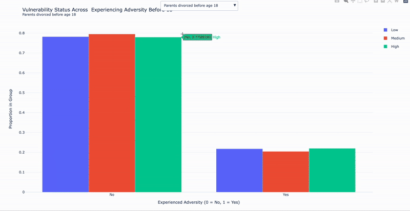

# CS506Final_Project
Link to Dataset: https://www.icpsr.umich.edu/web/NACDA/studies/37404/variables?start=850&sort=VARLABEL_SORT%20asc&STUDYQ=37404&EXTERNAL_FLAG=1&ARCHIVE=NACDA&rows=50# 

## Description of the project.
Conduct exploratory analysis on what factors influence the health(emotional,mental, physical) and satisfaction(including happiness) of relationships between married couples. What factors are strongly correlated with healthier and happier relationships? Are there any patterns we notice in unhealthy relationships when it comes to spouse behavior?
The categories that would be interesting to explore are general relationship health & satisfaction, emotional & mental Health in Relationships, physical health & relationship quality, conflict & unhealthy relationship patterns, external influences on relationships, gender & role dynamics in relationships and predictiong relationship succsess/ struggle

The data is available online for public use , however it needs to be engineered to include variables that are more relevant to the questions being asked and refine into a subset of data that can be easier to workwith.
Modeling Options: Linear/Logistic  Regression, Decision Trees
Visualization: Bar plot, Scatter plot, Heat Maps, line graphs, area graphs, I also want to create an interactive where we can see different facotrs on happiness/satisfaction/ health
Test plan: the conventional 80/20 rule , 20 used to train and 80 used to test. I also want to validate the models create with acccuracy, precision, recall and  f1 scores

## Midterm Report
Video: https://youtu.be/N13AAylApxM 
#1 Understanding Dataset and Variables
I initially started this entire process by trying to understand the data I was given and the variables I was working with. I believe there are around 500 variables, and since this was a survey where participants were asked questions before giving their responses in a quantitative way, I wanted to ensure I had an in-depth understanding of the survey. I went through the codebook and first looked at all the variables and their categorizations. I created a document to organize this information, where I categorized the variables into different themes and noted what each variable represented. The categories that variables can fall under as of now are Mood, Physical Health, Interpersonal Support/Strain, Daily Stressors, Emotion Work, Intimacy, Interactions with Spouse, Personal Control, Satisfaction & Happiness, and Previous Adversity. Some variables can also overlap.
Data Cleaning and Handling Nulls
I started by cleaning the data and obtaining initial information about the dataset, such as the number of rows and columns. There were no "nulls" originally in the dataset, but there was null-adjacent data where, for participant privacy, responses were replaced with "MASKED BY ICPSR," which I converted into null values. I checked that all inputs were numeric; if not, they were set to null. Additionally, I removed unusual inputs that disrupted later functions. I chose not to drop rows with null values because I realized that many of the null cells contained information irrelevant to the columns I was interested in. If I had dropped them, the dataset would have been empty.
Checking for Correlative Relationships
Since I am working with an extensive number of variables, I wanted to see which variables were correlated for exploratory analysis. I assumed these variables would be more important and help me craft questions related to the overall topic of the project. To do this, I created a correlation matrix to visualize linear relationships and a Spearman correlation matrix to detect nonlinear correlations. Initially, the correlation matrix was a bit messy, so I applied a threshold of 0.5, as I was only interested in moderate to high correlations. I exported these correlations for further examination.
Creating Subsets of Data for Preliminary Visualizations
My visualizations for correlated features are not yet complete, nor do they explore as many categories as I would like. Below are the current visualizations and the methods used to create them:
1.Mean of Emotional Self-Rated Health over the past 24 hours vs. Mean Physical Self-Rated Health over the past 24 hours (Bar Chart)

2.Relationship Satisfaction across Different Stress Variables (Stress Friends, Stress Family, Stress Spouse, Stress Work, Stress Finances) – A separate box plot for each variable. I also created a grouped bar chart to present similar information differently. I wanted to experiment with different ways of representing the same data to find the most easily understandable format.

3.Line Graph of Average Relationship Satisfaction by These Behaviors: spouse listens, relationship happiness, feeling like you can confide in a partner, relationship rewarding, and respondent feeling like their spouse loves and cares.

Visualizations I would like to continue working on:
-The impact of adverse childhood experiences on relationship outcomes

-A comparison of physical health in happier vs. less happy relationships

-Specific behaviors correlated with happier vs. less happy couples

There are many more areas to explore since this is an exploratory study.
Predictive Modeling #1
I created a decision tree (random forest regression model) to predict the following metrics: Feelings of Relationship Satisfaction, Relationship Happiness, and Relationship Rewarding. I had to pivot because my model does not handle nulls, so I replaced missing values with the average of the respective column. As stated earlier, I could not drop the nulls because that would leave the dataset empty.
To determine which parameters or "behaviors" to include, I considered:
-A combination of variables representing different behaviors and actions

-Variables that were positively or negatively correlated with the target metrics

-General relationship behaviors that I believed could influence someone's happiness

I adjusted my parameters three times to fine-tune my model. After my initial model, I used R² and MSE to evaluate its performance, yielding scores of 0.93 and 0.09, respectively. The model improved with each iteration. I also performed cross-validation to assess its performance on new data. Surprisingly, despite the strong initial performance, the cross-validation scores for MSE and R² were 0.61 and 0.5, respectively. After tweaking my parameters for the third time, I ended up with an R² of 0.9986 and MSE of 0.0016, which is a strong improvement. However, cross-validation yielded a score of 0.53 for both metrics, along with an improved model MSE.
I attempted another method for selecting features by analyzing feature importance within the forest. I trained a model, selected the top 30 features, and used them as parameters, but this resulted in lower accuracy. I suspected that high-variance features might have been biased or that correlated features misled the model’s weighting.
When I examined feature importance using the features from my original model, the results differed from those of the top 30 features method. The model showed error issues in the code, so I chose to stick with my original approach. In the future, I plan to attend office hours to seek help with the discrepancy between my model’s high performance and lower cross-validation scores, as well as assistance with the top 30 features function.
I also wanted to perform hyperparameter tuning, but my computer takes too long to process it, and it never finished loading. I decided to postpone this step and focus on exploring other models for now.
Visualizing Prediction of Model #1
I plotted the actual values of the target metrics against their predicted values in a scatter plot. Additionally, I created a scatter plot of residuals to visualize model performance.
Predictive Model #2
Initially, I used K-means to cluster the following metrics: Feelings of Relationship Satisfaction, Relationship Happiness, and Relationship Rewarding. However, the results were visually unappealing and difficult to interpret due to the dimensionality of my data. I pivoted and used the elbow method to determine the optimal number of clusters, choosing six clusters. I also applied PCA to reduce the data’s dimensions for better visualization.
I focused only on data where the target metrics were high (ratings of 4 and above on a 1-5 scale). For each cluster, I aimed to identify dominant variables or behaviors. My plan is to analyze how these clusters compare to each other and what insights they provide about relationship dynamics.
To further compare the clusters, I created a bar graph showing how each cluster performed across all target metrics.
Future Work
This round primarily focused on traits and behaviors that lead to successful relationships. However, I definitely plan to explore the inverse—factors that contribute to relationship dissatisfaction.

---------------------------------------------------------------
# Final Report

**Reproducability**

1. download the dataset named '2Data.csv'

2. run in terminal 'make setup' to create the virtual environment and installl depenednncies

3. run 'make run' to install the project notebook

4. run 'make freeze'- if you want to modify the environment and update the requirements.txt

**Overall Data Cleaning & Preprocessing**

**1. Overall Data Cleaning & Preprocessing**

1 To begin, I conducted a thorough cleaning of the dataset and reviewed its basic structure, including the number of rows and columns. While the dataset did not contain standard null values initially, it included placeholder entries such as "MASKED BY ICPSR"   used to protect participant privacy. I treated these entries as nulls to ensure proper data handling. Next, I verified that all input values were numeric, converting any non-numeric values (e.g., strings or symbols) to nulls where appropriate. I also removed any anomalous or unexpected values that interfered with subsequent analysis and modeling functions.
I chose not to drop rows with missing values. Many of the nulls appeared in columns unrelated to the core variables I was analyzing, and dropping them would have resulted in the loss of nearly all the data. Instead, I preserved these rows and focused only on relevant variables during specific analyses.

**2. Initial Understanding of Data & Scaling Data Down**

A significant portion of time was dedicated to carefully reviewing the dataset’s codebook. I flagged variables based on different categories (emotional, relational, behavioral, health-related) to better understand the structure and potential relevance of each. This process was essential for building a foundational understanding of the dataset and navigating the variables. It helped me grasp the significance and scale of various variables, which directly influenced the kinds of models, comparisons, and visualizations I was able to develop later. This step ensured that my analysis was both meaningful and grounded in the data’s context.
Given the large number of variables, I needed to scale the dataset down for both computational efficiency and interpretability. I selected a targeted subset of features that were relevant to my research questions and modeling goals. This reduction allowed for a more focused analysis without overwhelming the models with noise or redundancy, while still preserving key behavioral, relational, and health-related traits.

**3. Checking for Correlative Relationships**

Given the large number of variables, I conducted an exploratory correlation analysis to identify which features might hold meaningful relationships. I hypothesized that more strongly correlated variables would be particularly important and could guide the development of relevant research questions. To begin, I created both a Pearson correlation matrix for detecting linear relationships and a Spearman correlation matrix to capture potential nonlinear trends. The initial output was difficult to interpret due to the density of variables, so I applied a correlation threshold of 0.5 to highlight only moderate to strong relationships. This filtering made the results more interpretable and allowed me to focus on patterns that stood out. I then exported these filtered correlations for further analysis and comparison with later model results

**4.  Exploratory Data Analysis**

In this stage, I aimed to visually explore potential relationships and patterns among key variables. I created a series of initial visualizations to better understand the data and identify trends that might support or inspire deeper analysis.
These visualizations included:
-Box plots illustrating how relationship satisfaction varied across different stress profiles.
-A bar chart summarizing self-reported physical and mental health ratings.
-A line chart tracking average relationship satisfaction scores across various relationship quality metrics.
These early visuals provided useful context and helped clarify which variables might be worth investigating more rigorously in the modeling phase.

**Model Creation and Proccess**

There are  4 classical models that were created, I will walk through how each model was created in detail and the visualizations for each model

**Model #1: Predicting Satisfaction, Happiness, and Rewardingness values in Relationships and  Visualizations**

Process:

This model predicts  three key relationship satisfaction scores: RELSATIS, RELHAPPY, and RELREWAR using a Random Forest classifier. First, the features (behaviors) are separated from the target variables. Missing values in the features are filled using the mean, while missing values in the targets are filled using the most frequent value, since the targets are categorical. The data is then split into training and test sets.

To improve model performance, hyperparameter tuning is done using GridSearchCV. The tuning is guided by precision score, meaning the model was optimized to make as few false positives( predicting low rel as high) as possible since there are more positievly scored relationships than negative ones in the data. The best parameters from this grid search are used to build a MultiOutputClassifier, which allows the Random Forest to predict multiple targets at once.

The primary evaluation tools included precision, accuracy, Mean Squared Error (MSE), and R-squared .

Precision and Accuracy Scores:

From the classification report, the model showed solid precision and accuracy for all three satisfaction outcomes

The model demonstrated strong performance across all three target variables: relationship satisfaction (RELSATIS), relationship happiness (RELHAPPY), and relationship reward (RELREWAR). For RELSATIS, the model achieved a high precision of 0.99 and an accuracy of 98.4%, showing its ability to consistently make correct predictions across different satisfaction levels. Similarly, for RELREWAR, the model maintained a high level of performance with a precision of 0.99 and accuracy of 97.8%. The performance for RELHAPPY, while still strong, was slightly lower, with a precision of 0.98 and an accuracy of 95.1%.

Cross-Validation Results:
To validate the model’s consistency and generalizability, 5-fold cross-validation was applied to each satisfaction metric. The average precision scores across folds were:

RELSATIS: ~0.62

RELHAPPY: ~0.58

RELREWAR: ~0.62

After training the model, its performance is evaluated for each satisfaction variable using accuracy and a classification report. Finally, the most important features  used in making predictions are extracted and the top 30 are visualized using a bar plot.

**Top contributing Features Visualization**

Analysis: Behaviors like your spouse being lovign and caring, feeling like you can confide in your relationship, stress level with your spose, sex satisfaciton, and argument frequncy shed insight int predicitng these targets

**Model Residuals Visualization**

Happiness Prediction Residuals

Rewardingness  Prediction Residuals

 

Satisfaction Prediction Residuals

These residuals show how close the models  predicitons and actual results were.

**Model 2: K-means Clustering to uncover patterns in high performing relationships**

Process:
Kmeans clustering is used to  explore subgroups within individuals who report high levels of relationship satisfaction, happiness, and reward. First the dataset is filtered  to include only participants scoring 4 or above on all three of those relationship quality measures ( happiness, satisfaction, rewardingness). The data is standardized to ensure all features contribute equally. To determine the optimal number of clusters, the elbow method is used. Based on the plot, the final number of clusters was set to 5. KMeans clustering is then applied to group individuals into behavioral clusters.

To visualize these high dimensional clusters PCA is used to reduce the data to two components. These PCA transformed coordinates are then plotted, with cluster centers marked. The axes of the PCA plot are interpreted by examining the top contributing features to each principal component. For instance, the first component (PC1) is strongly influenced by variables like “SPSLOVED” and “INTIMACY,” which reflect emotional intimacy and affection. The second component (PC2) is shaped by features such as “LISTEN” and “UNDERSTD,” representing communication and understanding. This process helps give meaningful interpretation to abstract dimensions and supports qualitative labeling of the clusters in the PCA plot.

**Labeling Dominant Traits in Clusters**

Meaningful labels are assigned to clusters based on patterns in different types of relationship behaviors in those clusters. First, three behavior groups are defined: Affectionate (like feeling loved or close), Good Communicators (like listening and sharing feelings), and Problem Solvers (like helping with issues). For each group  the overall average and standard deviation across all clusters is calculated.

A dominance threshold for each group is set, if a cluster's behavior average exceeds this threshold, that's its behavior group is considered “dominant” in that cluster. For each cluster, it checks which behavioral traits exceed the threshold and assigns a name based on the most dominant ones. If no group strongly stands out, the cluster gets a milder label based on its top 1–2 traits.

Finally,  these labels  are mapped back to the main dataset so each individual in the high satisfaction group is tagged with a descriptive cluster label. 

**Fuzzy Clustering and  Assignmnets:**

The siloutte Score is pretty low for this model ( 0.054), but honestly its understandable considering we are working with behavioral data, especially for a target group that includes alot of overlapping beahviors
So fuzzy clustering is used to make soft assigmnets aka more flexible assignments to the data  of the data.

Using fuzzy c-means, each behavior is allowed to belong to multiple clusters to varying degrees, rather than being assigned to just one. The data is first standardized and transposed so that behaviors are treated as the items being clustered. The fuzzy c-means algorithm is then applied with five clusters, resulting in a membership matrix that shows the degree to which each behavior belongs to each cluster. A histogram is plotted to display the distribution of the highest membership strengths, offering insight into how confidently behaviors are grouped. Finally, the results are visualized using PCA to reduce dimensions, where each behavior is plotted with color indicating its dominant cluster and transparency representing confidence.

Histogram

Fuzzy

**Visualizations and Analysis** 

(each visualization, interactive visualization, and gif can be found in the visualization folder)

In the following sections, I will walk through the resulting visualizations, and provide an analysis of what those results reveal about patterns in relationships.

**Visualization #1: Relationship Satisfaction Accross Stress Types**

 The bar plot illustrates how relationship satisfaction varies across different stress types and levels. Overall, there is a clear pattern showing that as stress levels increase, relationship satisfaction tends to decline. This trend is most pronounced for stress related to a spouse or partner, where satisfaction drops sharply from high to low as stress intensifies. This suggests that interpersonal stress within the relationship itself is particularly damaging to perceived relationship quality. In contrast, other stress types show marginal and less severe decreases in satisfaction.

**Visualization #2 Relationship Satisfaction by Perceptions of Relationship Quality**

This line chart shows how different aspects of relationship quality relate to overall relationship satisfaction. In general, when people rate their relationships more positively like feeling loved, being able to confide in their partner, or thinking the relationship is rewarding, their satisfaction is higher. Most lines move upward as the response level increases, showing a strong link between better relationship experiences and greater satisfaction. This suggests that feeling supported and emotionally connected in a relationship strongly boosts satisfaction.
 
 
**Visualization #3: Mean Scores of Relationship Variables across Relationship Stress Levels**

This bar chart shows how different aspects of relationship quality change as stress from a spouse increases. As stress levels go up from 1 to 5, scores for positive traits like relationship happiness, feeling loved, satisfaction, and being able to confide in your partner consistently go down. Meanwhile, negative experiences, such as bad treatment from the spouse, increase. This pattern suggests that higher stress from a spouse is linked to worse relationship experiences, and I highlight "bad treatment" from's ones spouse. Error bars show 95% confidence intervals, which means these trends are likely reliable.

**Visualization # 4 Mean Scores of Confiding in Spouse Accross Relationship Behaviors**

This chart highlights a clear and consistent trend: as individuals report a higher ability to confide in their spouse, they also tend to experience stronger relationship behaviors and emotional well being. Each bar group shows that higher levels of confiding are associated with increased mean scores in four key areas: being healthy together, listening to a spouse, trying to understand a spouse, and emotional health within the past 24 hours.  The steady rise in scores, especially in listening and understanding suggests that the ability to confide in a spouse is strongly associated with these other behavioral aspects. 

**Interactive Visualizations**

**Intercative Visualization #1:  Vulnerablity Status accross Various Adversities**

This visual is suppoused to shed light on the proportions of hi, low, and meduim vulnearble coded people in relationshhips. It's supposued to see if previous adverse experiences affected people's vunlenerabliites in relationships. We can see the trends in the vulnerabilty groups for people have expereicned or havent.

Process: 

The process of calculating low, medium, and high vulnerability status is based on responses to five relationship related variables: RELCONFI (ability to  confide in relationship ), SPLISTEN (partner listening), RSHWNEED (respondent shows needs in replationship), RKPFEEL (respondent keeps feleins to self ), and RCHANGE (respondent changes themeseves for partner ). Then, the median of each variable was calculated to serve as a benchmark for categorizing vulnerability levels. Variables were grouped into two types: positively oriented (where higher scores indicate better relationship functioning: RELCONFI, SPLISTEN, RSHWNEED) and negatively oriented (where lower scores are better: RKPFEEL, RCHANGE).
A person was classified as having low vulnerability if they scored better than or equal to the median on all positive variables and lower than or equal to the median on all negative ones. Conversely, a person was classified as high vulnerability if they scored worse than or equal to the median on all positive variables and higher than or equal to the median on all negative ones. Anyone who didn’t clearly fit into the high or low group was categorized as medium vulnerability.
This method allowed for a more balanced distribution of individuals into the three vulnerability levels based on their responses relative to the group median, rather than rigid cutoffs.

**Visualizations for High v Low Classified Relationships**

 Participants were grouped based on their responses to three key relationship metrics: satisfaction (RELSATIS), happiness (RELHAPPY), and how rewarding the relationship feels (RELREWAR). Those who scored 4 or higher on all three were labeled as having high satisfaction, while those scoring 2 or lower on any were considered to have low satisfaction.
 

**1. 2d PCA Projcetion of High v Low Relationships**

**2. 3d PCA Projection of High v Low Relationships**

**3. UMAP Projection of High v Low  Classified Relationships (2d, 3d, animation)**

**4. UMAP Projection Interactive: High v Low Relationships accross Features**
 (link to html in folders)
 Low Relationship points have been surrounded with a red ring for identification

 Critiquing Souse

 

Intimacy with Spouse

 

Praises Spouse 

 

Relationship Warm

 

Spouse Loving

Process:

This analysis aims to explore behavioral differences between individuals in high versus low satisfaction relationships by using PCA (Principal Component Analysis) to reduce dimensionality for visualization. Participants were grouped based on their responses to three key relationship metrics: satisfaction (RELSATIS), happiness (RELHAPPY), and how rewarding the relationship feels (RELREWAR). Those who scored 4 or higher on all three were labeled as having high satisfaction, while those scoring 2 or lower on any were considered to have low satisfaction. Behavioral variables were then standardized, and PCA was applied to reduce them to two principal components, allowing the data to be visualized in two dimensions. This PCA projection helps identify whether distinct behavioral patterns exist between the two groups. In the resulting plot, each point represents an individual, and the color indicates their satisfaction group. The distribution of these points reveals how behaviors may cluster differently depending on relationship satisfaction, offering insights into which behavioral traits are associated with more fulfilling relationships. 
To understand what influenced the PCA graph, I looked at which behaviors had the biggest impact on the new axes (PC1 and PC2) through the component loadings. The top 10 behaviors with the highest values on PC1 and PC2  are the ones that most strongly separate people in the graph. This helps to  see which behaviors matter most when telling apart high and low satisfaction relationships.

UMAP was used to visualize the data in a way that captures more complex, non linear relationships between behaviors and relationship satisfaction. UMAP can reveal hidden clusters or groupings that aren't visible with straight-line methods. After scaling the features, UMAP reduced the high dimensional data into two dimensions for easier plotting. Each point on the scatter plot represents a person, colored by whether they reported high or low relationship satisfaction. The axes arent interpretable for umap, however plotting with the features accross can help identify behavior patterns.

 

